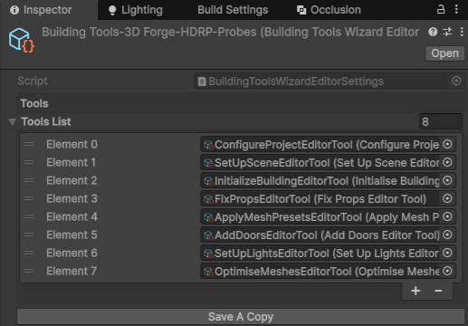

# Building Wizard Editor Settings

The Building Tools Editor window is driven by Scriptable Object instances. These are instances of `ScriptableObject` classes that contain specific configuration for a particular use case, and the code associated with that tools purpose.

There are two types of object that you'll be interested in:

1. Building Tools - these are individual tools that perform a particular purpose.
2. Building Wizard Settings - these are groups of Building Tools that drive the Building Editor UI window.

## Building Tools

Each tool in the package is represented as an instance of the base `BuildingTool` class, which is itself inherits from `ScriptableObject`. The configuration for each tool is therefore held within that instance, and can be viewed and modified by selecting the instance in the project window, or by using the settings cogs in the main editor window.

For example, if you click the settings icon next to the "Fix Props" tool, you'll see exactly what parameters can be configured for that tool:

You can create your own instances of tools, and configure them for your particular use case, by either duplicating an existing instance manually or by creating a new object instance using the asset menu:

`Assets > Create > Daft Apple Games > Building Tools`

## Building Wizard Settings

The combination of tools instances are contained in a single Scriptable Object of type `BuildingWizardEditorSettings`, which is what drives the content and functionality of the editor window. When such a file is selected in the "Settings" property of the Building Tools Editor window, it is parsed and the UI generated based on the tools associated with that particular file.

When you install the sample packages, you'll see a number of instances of this object installed, each with references to tools configuration instances for different scenarios:

If you look one of the preconfigure `BuildingWizardEditorSettings` files in the inspector, you'll see references to these tool presets:

You can create your own instances of tools, and configure them for your particular use case, by either duplicating an existing instance manually or by creating a new object instance using the asset menu:

`Assets > Create > Daft Apple Games > Building Tools`

> [!TIP]
>
> You can also click the "Save a copy..." button from the main Editor Window. This will prompt you to pick a folder within your assets directory, and will save a copy of the settings **as well as copies of each of the associated tool settings**. It will then set this new settings files as active in the editor. This way, you can very quickly create a distinct set of pre-sets from a single settings file.

Having created or duplicated a settings file, you can remove, add, replace, and re-order the list of tools by selecting it and dragging your tools instances into the inspector window:

